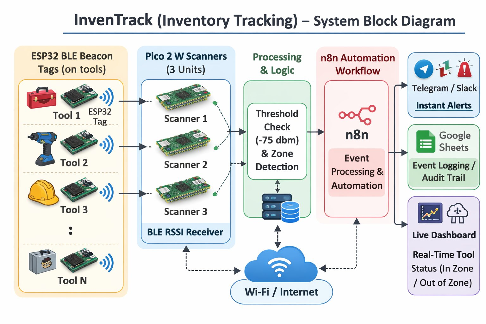
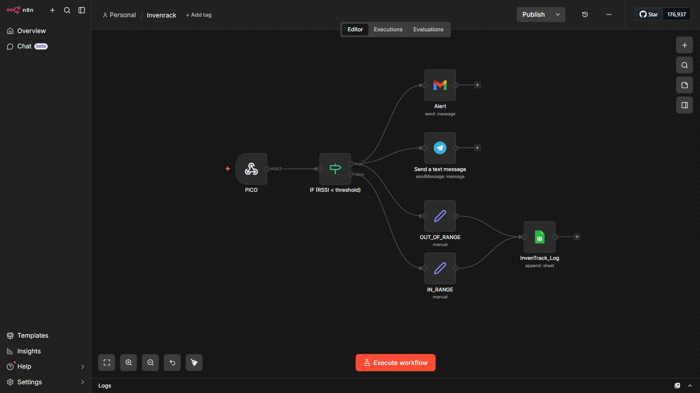
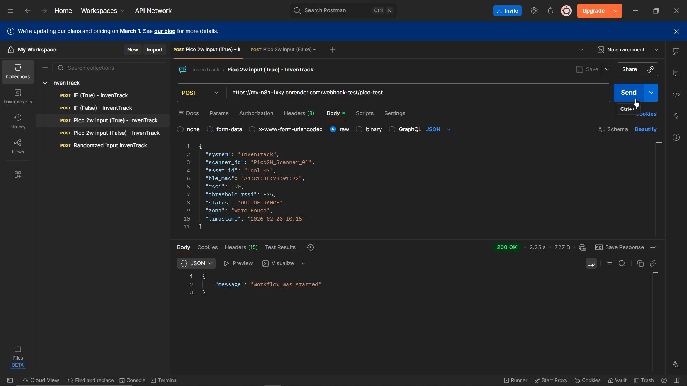
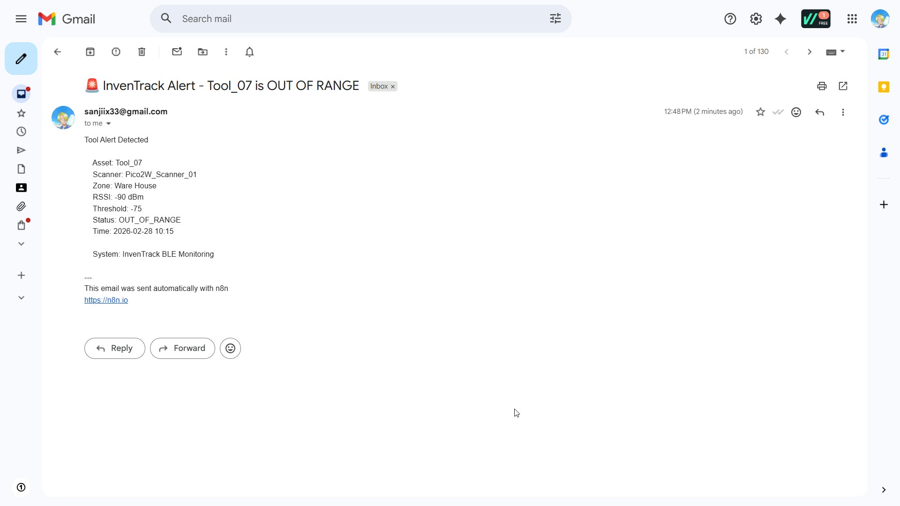
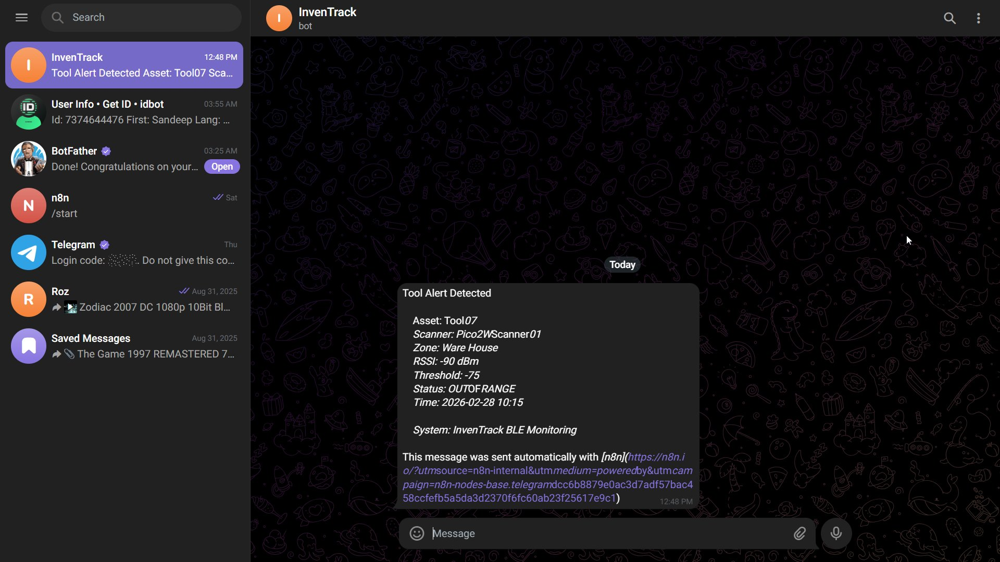
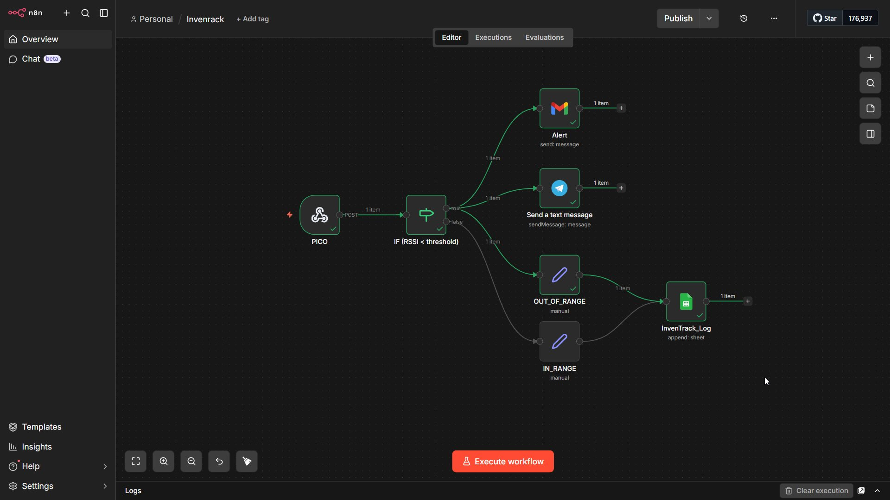
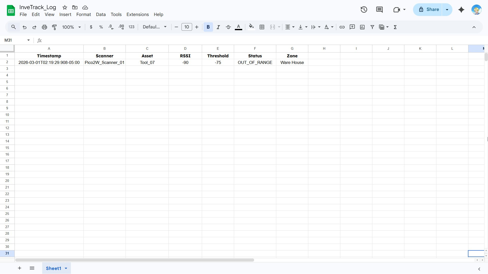

# 📦 InvenTrack — BLE-Based Inventory & Asset Tracking System

<p align="center">
  
</p>

<p align="center">
  
  
  
  
  
</p>

---

## 🔍 Overview

**InvenTrack** (Inventory Tracking) is a low-cost, real-time asset tracking system built using **Bluetooth Low Energy (BLE)**. It monitors tools and equipment in labs, workshops, and factory environments — automatically sending alerts when assets move out of a defined zone.

> ✅ Built as a **Mini Project** at college. Fully functional, tested end-to-end.

---

## 🎯 Problem Statement

In labs, factories, and workshops:
- Tools go **missing or misplaced** without any notice
- Staff waste time **manually searching** for tools
- **No real-time visibility** of tool availability or location
- High-value tools are at **risk of loss or misuse**

InvenTrack solves this with automated, continuous BLE-based monitoring.

---

## 🏗️ System Architecture

```
ESP32 BLE Tags (on tools)
        │
        │  BLE Signal (RSSI)
        ▼
Raspberry Pi Pico 2W Scanners (3 units)
        │
        │  HTTP POST (JSON)
        ▼
n8n Automation Workflow (Webhook)
        │
   ┌────┴────┐
   ▼         ▼
IF RSSI < -75 dBm?
   │         │
  YES        NO
   │         │
   ▼         ▼
📧 Gmail Alert     📋 Log IN_RANGE
📱 Telegram Alert     to Google Sheets
📋 Log OUT_OF_RANGE
   to Google Sheets
```

---

## ⚙️ How It Works

1. **ESP32 BLE Beacon Tags** are attached to each tool/asset. They continuously broadcast BLE advertisement packets.

2. **Raspberry Pi Pico 2W Scanners** (3 units) listen for BLE signals and measure the **RSSI (Received Signal Strength Indicator)** of each tag.

3. The Pico 2W sends a **JSON payload via HTTP POST** to an **n8n webhook** hosted on the cloud (Render.com).

4. **n8n workflow** evaluates the RSSI:
   - If RSSI < threshold (e.g., `-75 dBm`) → Asset is **OUT OF RANGE**
   - Triggers: **Gmail alert + Telegram notification + Google Sheets log**
   - If RSSI ≥ threshold → Asset is **IN RANGE**
   - Triggers: **Google Sheets log only**

---

## 🛠️ Tech Stack

| Layer | Technology |
|---|---|
| BLE Beacon Tags | ESP32 (MicroPython / Arduino) |
| BLE Scanners | Raspberry Pi Pico 2W (MicroPython) |
| Automation / Logic | n8n (self-hosted on Render) |
| Alerts | Gmail API, Telegram Bot |
| Logging | Google Sheets (via n8n) |
| API Testing | Postman |
| Transport | HTTP/HTTPS (Wi-Fi) |

---

## 📸 Demo Screenshots

| n8n Workflow | Postman API Test |
|:---:|:---:|
|  |  |

| Gmail Alert | Telegram Alert |
|:---:|:---:|
|  |  |

| n8n Execution (Live) | Google Sheets Log |
|:---:|:---:|
|  |  |

---

## 📦 Sample JSON Payload

The Pico 2W sends this payload to the n8n webhook:

```json
{
  "system": "InvenTrack",
  "scanner_id": "Pico2W_Scanner_01",
  "asset_id": "Tool_07",
  "ble_mac": "A4:C1:38:7B:91:22",
  "rssi": -90,
  "threshold_rssi": -75,
  "status": "OUT_OF_RANGE",
  "zone": "Ware House",
  "timestamp": "2026-02-28 10:15"
}
```

---

## 🔔 Alert Example

**Gmail:**
```
Subject: 🚨 InvenTrack Alert - Tool_07 is OUT OF RANGE

Tool Alert Detected
Asset: Tool_07
Scanner: Pico2W_Scanner_01
Zone: Ware House
RSSI: -90 dBm
Threshold: -75
Status: OUT_OF_RANGE
Time: 2026-02-28 10:15
System: InvenTrack BLE Monitoring
```

**Telegram Bot:** Same message delivered instantly to your phone.

---

## 📁 Repository Structure

```
InvenTrack/
├── README.md                    ← You are here
├── docs/                        ← Screenshots, diagrams
│   ├── system-block-diagram.png
│   ├── n8n-workflow-idle.png
│   ├── n8n-workflow-executed.png
│   ├── postman-test.png
│   ├── gmail-alert.png
│   ├── telegram-alert.png
│   └── google-sheets-log.png
├── hardware/
│   ├── esp32_ble_beacon.py      ← ESP32 BLE beacon code
│   └── pico2w_scanner.py        ← Pico 2W BLE scanner + HTTP sender
├── n8n/
│   └── inventrack_workflow.json ← Exported n8n workflow (importable)
├── dashboard/
│   └── index.html               ← Live status dashboard (HTML)
└── .github/
    └── CONTRIBUTING.md
```

---

## 🚀 Getting Started

### Prerequisites
- Raspberry Pi Pico 2W (with MicroPython firmware)
- ESP32 development board
- n8n account (free at [n8n.io](https://n8n.io) or self-hosted)
- Telegram Bot Token (from @BotFather)
- Google account (for Gmail + Google Sheets)

### Setup Steps

**1. Flash ESP32 beacon firmware**
```bash
# Upload hardware/esp32_ble_beacon.py to your ESP32
# Edit the ASSET_ID and BLE_NAME variables
```

**2. Flash Pico 2W scanner firmware**
```bash
# Upload hardware/pico2w_scanner.py to each Pico 2W
# Configure Wi-Fi credentials and n8n webhook URL
```

**3. Import n8n Workflow**
- Open your n8n instance
- Go to **Workflows → Import**
- Upload `n8n/inventrack_workflow.json`
- Configure Gmail, Telegram, and Google Sheets credentials

**4. Test with Postman**
- Import the collection or manually POST to your webhook URL
- Use the sample JSON payload above

---

## 📊 Use Cases

- 🏭 **Factory Tool Cribs** — Monitor 20+ tools across a warehouse floor
- 🔬 **QA Labs & R&D Workshops** — Track calibration instruments
- 🚁 **Drone Assembly Labs** — Keep specialty parts in check
- 🏠 **Home Workshops** — Never lose an expensive tool again

---

## 📈 Future Enhancements

- [ ] Mobile app (Flutter/React Native) for on-the-go monitoring
- [ ] Cloud-based dashboard with historical analytics
- [ ] Advanced indoor positioning (triangulation with 3+ scanners)
- [ ] MQTT protocol support for lower latency
- [ ] Battery-level monitoring for ESP32 tags

---

## 👥 Team

| Name | Roll No |
|---|---|
| S. Pranitha | 24J25A0420 |
| N. Praveen Kumar | 24J25A0415 |
| K. Sandeep | 23J21A0417 |
| G. Naveen Kumar | 23J21A0415 |

---

## 📄 License

This project is licensed under the MIT License — see [LICENSE](LICENSE) for details.

---

## 🌟 Star this repo if you found it useful!

> *"InvenTrack makes tool management smarter and more reliable."*
